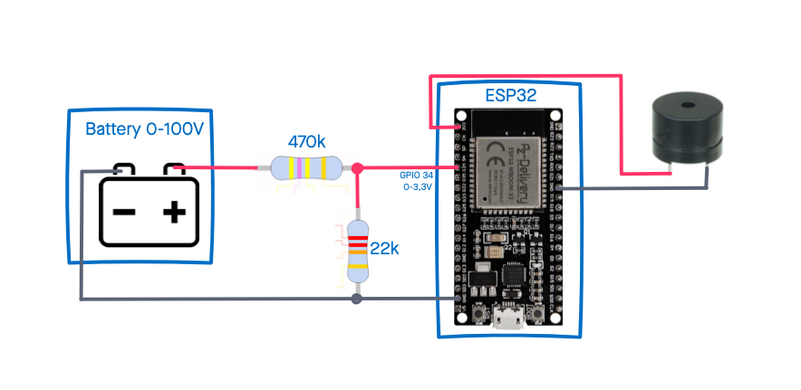

# funwheel-controller

This repository contains code to add some additional features to the [Funwheel](https://www.youtube.com/watch?v=K8beIoe0NuM) by enhancing it with a separate ESP32-controller to control front- and back-lights, monitor the battery and add Bluetooth VESC-UART-bridge

The ESP32 D1 Mini is highly recommended, but other ESP32 also work.

## Hardware and wiring

### Hardware

Find the recommended hardware below. Other parts may also work, but the recommended parts are best tested.

- [ESP32 D1 Mini](https://www.amazon.de/AZDelivery-Bluetooth-Internet-Development-Compatible/dp/B08BTRQNB3/), other ESP32 might also work but check if all needed GPIO are accessible

- DC-DC converter ([LM2576HV](https://www.banggood.com/RIDEN-5V-60V-To-1_25V-30V-LM2576HV-DC-DC-Step-Down-Module-p-1060892.html?cur_warehouse=CN&rmmds=search))

- Piezo-Buzzer (any model should work)

For WS28xx Adafruit Neopixel are recommended

- 4x [Adafruit Neopixel stick](https://www.adafruit.com/product/1426) or compatible. Solder 2 sticks together for front and back each.

If you want to use COB modules, tri-color 12V COB with two MOSFET modules are recommended

- [Tri-Color COB module](https://de.aliexpress.com/item/4001104767020.html?spm=a2g0s.9042311.0.0.172a4c4dnC5uX4)
- [D4184 MOSFET module](https://www.banggood.com/3pcs-D4184-Isolated-MOSFET-MOS-Tube-FET-Relay-Module-40V-50A-p-1444317.html?rmmds=myorder)

### Wiring

Connect you VESC (e.g. [Cheap FOCer 2](https://github.com/shamansystems/Cheap-FOCer-2)) to the RX- and TX-PINs of the UART2 of your ESP32 (GPIO 16 & 17).

Connect your WS28xx pixel to the DC-DC converter and attach the DIN-Pin to GPIO 5 of your ESP.

Connect your Cheap FOCer to GPIOs of the ESP32 as follows:

|ESP32 | Cheap FOCer 2|Description|
|:---:|:---:|:---:|
|GPIO 16 | TX||
|GPIO 17 | RX||
|GPIO 18 | PC13 | forward|
|GPIO 19 | PC14 | backward|
|GPIO 21 | PA15 | brake |
|GPIO 5 | PB12 | buzzer |

Connect your Piezo buzzer with the negative lead to GPIO 0 and the positive lead to GND.

## Features

- Support for Front- and Backlight
- Battery monitor (visual and acoustic)
- transparent BLE-UART bridge for VESC-App

### Front- and backlight control

When powered the lights show a short startup sequence. While riding, the LEDs in drive direction are shining white and the LEDs facing against riding direction shine red.

When braking the lights at the back will flash red.

#### COB version

In this version, two 12V COB modules are controlled by MOSFETs. When using tri-color COB, switching the light color from white to red and vice versa based on the driving direction is supported.

The recommended COB (see above) are very bright, use up to 10W and  get very hot when operating at 12V. Therefore they should be operates with 10.5V only.


#### WS28xx (Neopixel) version

In this version WS28xx (aka Neopixel) LEDs are used for the front- and backlight. Dependening on the number of LEDs and the specs of the used ESP32 and WS28xx, it might also be possible to connect the WS28xx stripe directly to 3,3V of the ESP32. Nevertheless it's recommended to safely power the WS28xx stripe with a separate DC/DC converter.


Using any other number of LEDs then 16, the `NUMPIXELS` definition has to be changed in the config.h file.

### Battery monitor

The battery monitor uses a simple voltage divider which allows measuring the voltage from 0 - 100 V with the analog input of an ESP32. The voltage divider. The ESP12 uses 12bit (0-4095 )and 3.3V logic.



The battery level is monitored against the configured values. If the battery level drops close the configured value, the piezo buzzer will give you a warning tone. If the battery level drops under the configured value, an alarm tone sounds.

If a WS28xx stripe is connected, the battery level will also been shown in 100/PIXEL_NUMBER steps. (Coming soon)

### Transparent BLE-UART proxy for VESC app

The VESC applications for Desktop and Mobile are able to connect to the VESC via Bluetooth Low Energy (BLE). Normally you'll need a separate Bluetooth module (e.g. NRF51822) connected to your VESC. The ESP32 will do the same. Connected to the UART interface of the VESC, it allows to connect the App via BLE to the VESC.


## Build Firmware

This project is build on PlatformIO. To build the firmware for the ESP32 install the [core version](https://platformio.org/install/cli) of PlatformIO to your computer. An alternative way is to install the PlatformIO extension for your [favourite IDE](https://platformio.org/install/ide).

Clone this repository to your local computer and change into the created directory.

```shell
git clone https://github.com/thankthemaker/funwheel-controller && cd funwheel-controller
```

To build the firmware and upload it to you ESP32 MCU run

```shell
platformio run --target upload
```
